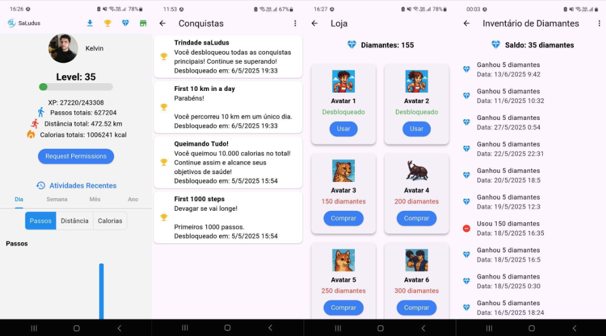

# SaLudus

From Latin *salus* (health) and *ludus* (game) — a gamified physical activity tracking app.

---

## Overview

SaLudus was originally developed as part of a final project for a Bachelor's degree in Computer Science.  
The goal was to create a mobile application that encourages and engages users in physical activities through gamification elements.

**Main goals:**
- Conduct initial research;
- Define a user-friendly and intuitive app;
- Select metrics to evaluate usability and efficiency;
- Develop a gamified physical activity tracking application;
- Test the app with users, collect results, and draw conclusions;

---

## Details

This Android mobile app includes four main screens and integrates with the **Google Health Connect API**, which enables health data sharing across compatible apps.  

SaLudus leverages this data to gamify the user's physical activity: as the user increases their total step count, distance walked, and calories burned, they gain **experience points, level up**, and unlock **achievements and cosmetic items**.

By using Google Health Connect, SaLudus accesses aggregated health data collected by other compatible apps, allowing it to focus on the gamification layer. All relevant data is also stored locally on the device using a **SQLite** database.

---

## Features and Screens

- **Main Screen –** User profile with: photo or avatar, level, total experience points, total steps, distance walked, and calories burned;
- **Main Screen –** Graph displaying recent physical activity stats;
- **Achievements Screen –** Unlockable trophies and achievements based on physical activity milestones;
- **Inventory –** Users earn diamonds when leveling up or unlocking achievements;
- **Shop –** Diamonds can be exchanged for premium items like original, stylized avatars to customize the profile;

---

## Tech Stack

- Dart: https://dart.dev/  
- Flutter Framework: https://www.flutter.dev  
- Google Health Connect API: (https://health.google/health-connect-android/) (https://pub.dev/packages/health)  
- SQLite (local database): https://sqlite.org/

---

## Screenshots
 

*Images shown are from the actual working app.*

---

## Video Demo

---

## 🚫 Source Code

> The source code of this project is **not publicly available**.  
> This repository is for **presentation purposes only**, showcasing features, design, and functionality.

---

## 📝 License

All rights reserved © 2025 Kelvin Chaves Vasconcelos  
This repository is for portfolio purposes only.  
No part of this content (images, text, videos, media) may be used, copied, or redistributed without prior written permission.  
See [LICENSE](./LICENSE) for more details.

---
